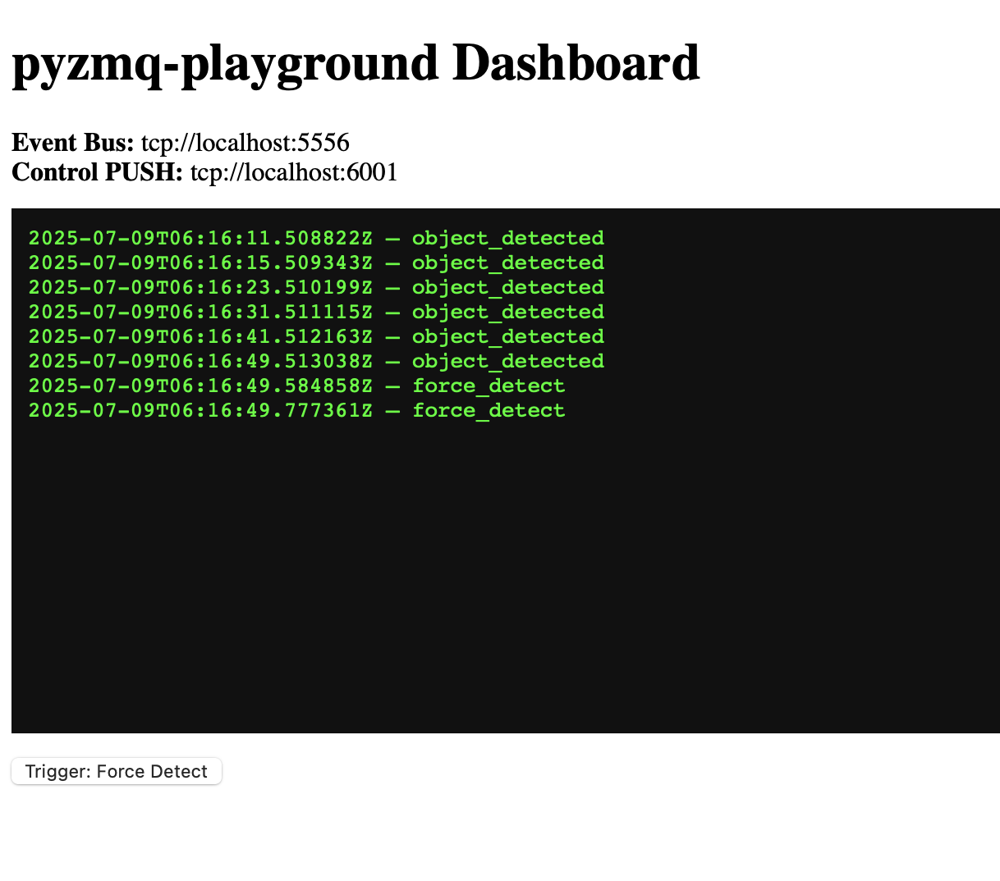

# 🌀 Python ZeroMQ playground


A tiny but mighty **ZeroMQ-powered playground** for experimenting with reactive, event-driven microservices — inspired by Geekscape’s [Aiko](https://github.com/geekscape) Framwork. Driven by **YAML config** for maximum flexibility.

---

## What’s inside?

**Orchestrator Proxy** — the central event bus:
- Receives streams from multiple `PUSH` sources (Detector, Dashboard)
- Publishes *all* events on a single `PUB` socket for Reactors

**Detector** — a fake TinyML module:
- Randomly detects “objects”
- Publishes JSON events via `PUSH` to the Proxy

**Dashboard** — a FastAPI web UI:
- Shows **live logs** in real time
- Sends **control commands** via `PUSH` (e.g., force detect)

**Reactors** — your event listeners:
- **LoggerReactor** logs all events to `events.log`
- **Reactor** prints events to console (simulate side effects)

**YAML Config**:
- All ports, addresses, log files, and scripts are defined in **`config.yaml`**
- No more hardcoded ports — swap them anytime!

---

## 🗂️ Directory structure

```
pyzmq-playground/
├── orchestrator.py          # Starts Proxy, Detector, Reactors based on config.yaml
├── orchestrator_proxy.py    # PULL/PULL → unified PUB relay
├── detector.py              # Fake detection → PUSH → Proxy
├── reactor.py               # Prints received events
├── logger_reactor.py        # Logs all events to file
├── web_dashboard.py         # FastAPI + websockets + buttons
├── index.html               # Dashboard UI
├── config.yaml              # All ports, addresses, files, log paths
├── docker-compose.yaml      # Compose config for containers
├── Dockerfile               # Container build
├── requirements.txt         # pyzmq, pyyaml, fastapi, uvicorn
└── README.md                # This doc!
```

---

## Architecture

**System Diagram:**

```
             +-------------------+
             |    Detector       |
             |   (PUSH -> 6000)  |
             +--------+----------+
                      |
                      v
             +---------------------+
             |  Orchestrator Proxy |
             |  (PULL 6000, 6001)  |
             |     -> PUB 5556     |
             +--------+------------+
                      |
      +---------------+----------------+
      |               |                |
      v               v                v
  LoggerReactor   Reactor         Dashboard SUB
    (5556)         (5556)             (5556)
```

- Reactors see *everything*: detection + control commands.
- One single **unified bus** for fan-out.
- Add new Reactors or Detectors just by editing `config.yaml`.

---

## Getting started

**Clone & create your venv**
```bash
git clone https://github.com/yourusername/pyzmq-playground.git
cd pyzmq-playground
python3 -m venv venv
source venv/bin/activate  # macOS/Linux
# or venv\Scripts\activate  # Windows
```

**Install dependencies**
```bash
pip install -r requirements.txt
```

**Run the Orchestrator**
```bash
python3 orchestrator.py
```

**In a separate terminal, run the Dashboard**
```bash
uvicorn web_dashboard:app --reload --host 0.0.0.0 --port 8000
```

Open [http://localhost:8000](http://localhost:8000) → see live events!

---

## Running with Docker 🐳

This playground can also run in containers!

**Build & start the containers**
```bash
docker-compose build
docker-compose up
```

**Stop & remove containers**
```bash
docker-compose down
```

**View logs**
```bash
docker-compose logs -f
```

The `docker-compose.yaml` should map your `config.yaml` and `index.html` properly!

---

## Clean up all Docker containers/images

```bash
docker stop $(docker ps -aq)
docker system prune -af
```

---

## Example: `config.yaml`

```yaml
bus:
  unified_pub: tcp://*:5556

proxy:
  file: orchestrator_proxy.py
  detector_pull: tcp://*:6000
  dashboard_pull: tcp://*:6001

detector:
  file: detector.py
  push: tcp://localhost:6000

dashboard:
  file: web_dashboard.py
  push: tcp://localhost:6001
  sub: tcp://localhost:5556

reactors:
  - name: logger_reactor
    type: logger
    file: logger_reactor.py
    sub: tcp://localhost:5556
    log_file: events.log

  - name: reactor
    type: print
    file: reactor.py
    sub: tcp://localhost:5556
```

---
## Screenshot


---

## How to extend

- Want another Detector? Add a new section with a unique `push` port.
- Want another Reactor? Add it to the `reactors` list.
- Need to change ports? Just tweak the YAML — no code edits needed.

---

## ⚡ Inspired by

Built as a learning playground after attending [Andy Gelme’s AI-ML-Robots](https://www.meetup.com/ai-ml-robots/) sessions in Melbourne.  
Big shoutout to [Aiko](https://sites.google.com/site/aikoplatform) for the ideas around *orchestrator, reactive microservices* for IoT and edge systems.

---

## License

MIT — fork it, play with it, break it, extend it!

---
